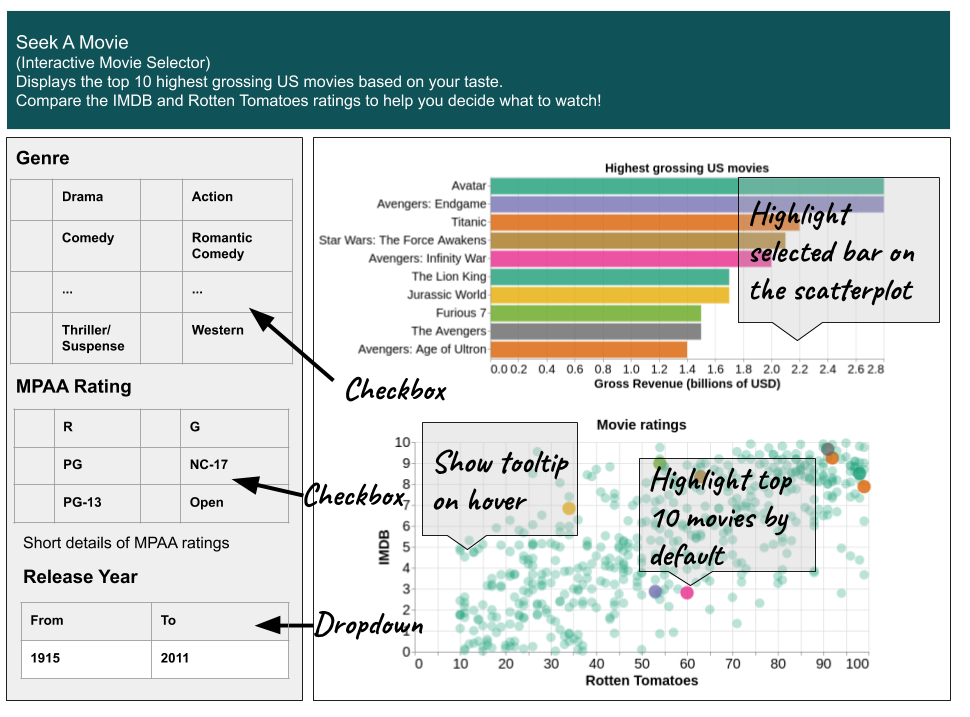

# DSCI_532_group_205
### Seek A Movie  
A movie selection dashboard built in Python using Plotly-Dash  

## Description of the app
`Seek A Movie` is a web application designed to help users select top grossing US movies to watch based on their preferences. Using the graphical user interface in the left panel, the user can select various options to filter movies and the app will select the best movies to watch based on total gross revenue. The first component is a checkbox that allows the user to select one or more of the different genres available. The second component is also a checkbox that can be used to select the various MPAA ratings. The final component is a range slider that can be used to select a range of release years for the movie.   

Based on the selection made by the user, the app will find the top 10 grossing US movies and display them on a bar chart. The scatterplot in the bottom will show the IMDB and Rotten Tomatoes ratings of all movies in the database. By default, the top 10 movies will be highlighted in the scatterplot with matching colours from the bar graph. When the user clicks on a particular movie on the bar chart, only that movie will be highlighted in the scatterplot. The scatterplot will be interactive with options to zoom and pan. When the mouse pointer hovers over the points in the scatterplot, the tooltip would display the movie name and ratings.     

## Sketch of the app
 

## Link to the deployed app:  
https://dsci-532-group-205-milestone2.herokuapp.com/  

## Functionalities of the app  
1. The app shows the top 10 grossing US movies and the IMDB and Rotten Tomatoes ratings,  filtered by genre, rating and release year specified by the user.   
2. Users can select one or more genres from the left panel.
3. Users can select one or more ratings from the left panel.  
4. Users can select a range of years for the movie release years.  
5. Plots will be updated as per the selection by the user. 
6. Barchart shows the gross revenues of the top 10 movies.  
7. The scatterplot shows the  IMDB and Rotten Tomatoes ratings of all movies in the database, with the top 10 movies highlighted with colours matching the bars on the bar chart.  
8. Both plots are interactive. It can zoom and pan. Also, tooltips show relevant information.  
9. Users can click on a bar in the bar chart and the respective movie in the scatterplot will be highlighted. This helps the user to compare the rating of his chosen movie to other movies.  
